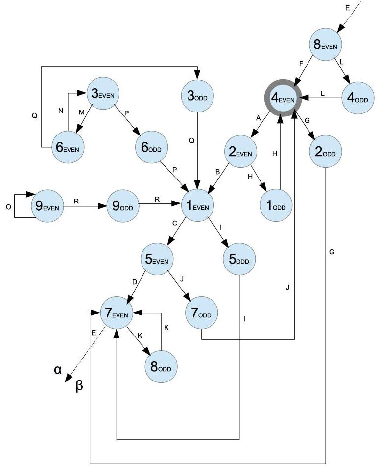

# math-x
Playground project built in [Crystal](https://crystal-lang.org/)
aiming to better understand the [Collatz conjecture](https://en.wikipedia.org/wiki/Collatz_conjecture)
nuances and patterns

### The Collatz conjecture
Start with any positive integer n and recursively apply the following logic:
* If the number is even, divide it by two (n / 2)
* If the number is odd, triple it and add one (n * 3 + 1)

The conjecture states that, no matter what selected value of n, the sequence will always reach 1

### Pre-requisites
* Download [Crystal](https://crystal-lang.org/docs/installation/on_debian_and_ubuntu.html)
  * version: 0.26+

### Run it
Leveraging Makefile it's possible to format, test, compile and execute code with
`make all`

Alternatively you can execute each action individually:
* Clean - Removes any binaries: `make clean`
* Format - Forces correct formatting: `make format`
* Test - Runs all tests: `make test`
* Build - Compiles code: `make build`
* Run - Runs code: `make run`

**Execute:**

`./bin/main -o RunOnce -v 300`

`./bin/main -o RunUpwards -v 400`

`./bin/main -o RunLoopAnalysis -v 10`

`./bin/main -o RunSpecial -v 50`

`./bin/main -o RunDiff -v 50`

`./bin/main --help `

### Line of thought

Let's organize all positive integers by:
1. Parity - Even or odd
1. Sum of Digits - {1,2,3,4,5,6,7,8,9} (mod 10)

##### Parity
|      n / 2    |   3 * n + 1   | P(X) |
|:-------------:|:-------------:|:----:|
| EVEN -> EVEN  | ODD -> EVEN   | 0.5  |
| EVEN -> ODD   | ODD -> EVEN   | 0.5  |

##### Sum of digits
| n / 2   | 3 * n + 1 |  P(X)  |
|:-------:|:---------:|:------:|
| 1 -> 5  |  1 -> 4   | 0.1(1) |
| 2 -> 1  |  2 -> 7   | 0.1(1) |
| 3 -> 6  |  3 -> 1   | 0.1(1) |
| 4 -> 2  |  4 -> 4   | 0.1(1) |
| 5 -> 7  |  5 -> 7   | 0.1(1) |
| 6 -> 3  |  6 -> 1   | 0.1(1) |
| 7 -> 8  |  7 -> 4   | 0.1(1) |
| 8 -> 4  |  8 -> 7   | 0.1(1) |
| 9 -> 9  |  9 -> 1   | 0.1(1) |

---

##### Flow diagram
* 9 (digitsSum) * 2 (parity states) = 18 nodes
* 9 (digitsSum) * 3 (parity transitions) = 27 edges

**Singularities:**
* (&#945;) M -> N -> M  (n / 2 * n / 2) (lim -> 6)
* (&#945;) O -> O (n / 2) (lim -> 18)
* (&#946;) K -> K (1.5 * n + 1) (lim -> &#8734;) !!!

**&#945; flows:**

* Any &#945; node will eventually reach 1EVEN

**&#946; flows:**

| Id    | Seq         | P(X) | Formula (Kx -> x) |
|:-----:|:-----------:|:----:|:------------:|
|&#946;1|A->H         |1/4   | (31 / 22) * n + (31 - 21) / 20 |
|&#946;2|A->B->C->J   |1/16  | (31 / 24) * n + (31 - 21) / 20 |
|&#946;3|A->B->C->D->Kx->E->F |1/32| (3x / 2x+6) * n + (3x - 2x) / 2x+1 |
|&#946;4|A->B->C->D->Kx->E->L |1/32| (3x+1 / 2x+6) * n + (3x+1 - 2x) / 2x+1 |
|&#946;5|A->B->I->Kx->E->F    |1/16| (3x+1 / 2x+5) * n + (3x+1 - 2x+1) / 2x+2 |
|&#946;6|A->B->I->Kx->E->L    |1/16| (3x+2 / 2x+5) * n + (3x+2 - 2x+1) / 2x+2 |
|&#946;7|G->Kx->E->F  |1/4   | (3x+1 / 2x+3) * n + (3x+1 - 2x+1) / 2x+2 |
|&#946;8|G->Kx->E->L  |1/4   | (3x+2 / 2x+3) * n + (3x+2 - 2x+1) / 2x+2 |

**1 iteration (generalized):**

## &#946;1 = (3x / 2y) * n + (3x - 2z) / 2w

**k iterations (generalized):**

## &#946;k = (3&#931;xk / 2&#931;yk) * n + &#931; ((3a - 2b*3c) / 2d)

---

#### How to prove conjecture:

1. &#946;i > &#946;i+1 (proved)

1. &#946;k = n has no solutions for any positive even integer n and n &#8801; 4 (mod 18) (not proved)

| Id    | Seq         | &#946;i+1 / &#946;i |
|:-----:|:-----------:|:----:|
|&#946;1|A->H         |3/16   |
|&#946;2|A->B->C->J   |3/256  |
|&#946;3,&#946;4|A->B->C->D->Kx->E->F&#124;L |1/256|
|&#946;5,&#946;6|A->B->I->Kx->E->F&#124;L    |3/64|
|&#946;7,&#946;8|G->Kx->E->F&#124;L  |3/4|
