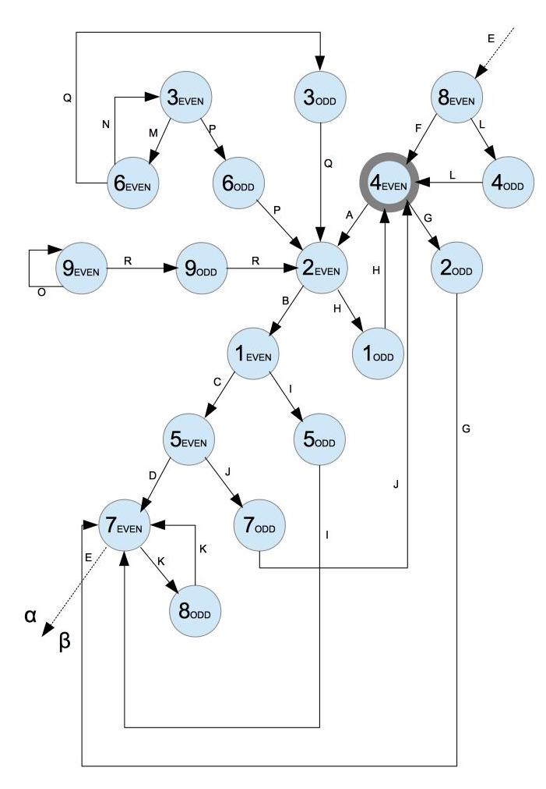

# math-x
Playground project built in [Crystal](https://crystal-lang.org/)
aiming to better understand the [Collatz conjecture](https://en.wikipedia.org/wiki/Collatz_conjecture)
nuances and patterns

### The Collatz conjecture
Start with any positive integer n
* If the number is even, divide it by two (n / 2)
* If the number is odd, triple it and add one (n * 3 + 1)
Repeat the process by assigning this result to n

The conjecture states that, no matter what selected value of n, the sequence will always reach 1

### Pre-requisites
* Download [Crystal](https://crystal-lang.org/docs/installation/on_debian_and_ubuntu.html)
  * version: 0.26+

### Run it
Leveraging Makefile it's possible to format, test, compile and execute code with
`make all`

Alternatively you can execute each action individually:
* Clean - Removes any binaries: `make clean`
* Format - Forces correct formatting: `make format`
* Test - Runs all tests: `make test`
* Build - Compiles code: `make build`
* Run - Runs code: `make run`

### Line of thought

Let's organize all positive integers by:
1. Parity - Even or odd
1. Sum of Digits - {1,2,3,4,5,6,7,8,9} (mod 10)

##### Parity
|      n / 2    |   3 * n + 1   | P(X) |
|:-------------:|:-------------:|:----:|
| EVEN -> EVEN  | ODD -> EVEN   | 0.5  |
| EVEN -> ODD   | ODD -> EVEN   | 0.5  |

##### Sum of digits
| n / 2   | 3 * n + 1 |  P(X)  |
|:-------:|:---------:|:------:|
| 1 -> 5  |  1 -> 4   | 0.1(1) |
| 2 -> 1  |  2 -> 7   | 0.1(1) |
| 3 -> 6  |  3 -> 1   | 0.1(1) |
| 4 -> 2  |  4 -> 4   | 0.1(1) |
| 5 -> 7  |  5 -> 7   | 0.1(1) |
| 6 -> 3  |  6 -> 1   | 0.1(1) |
| 7 -> 8  |  7 -> 4   | 0.1(1) |
| 8 -> 4  |  8 -> 7   | 0.1(1) |
| 9 -> 9  |  9 -> 1   | 0.1(1) |

---

##### Flow diagram
* 9 (digitsSum) * 2 (parity states) = 18 states
* 9 (digitsSum) * 3 (parity transitions) = 27 transitions

